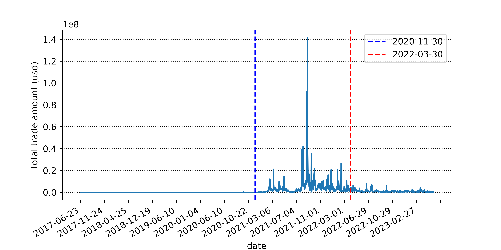
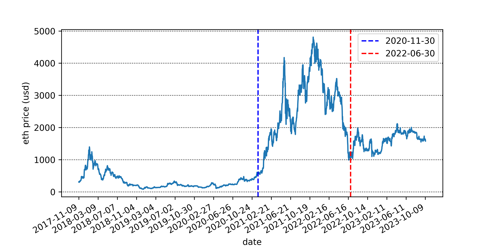
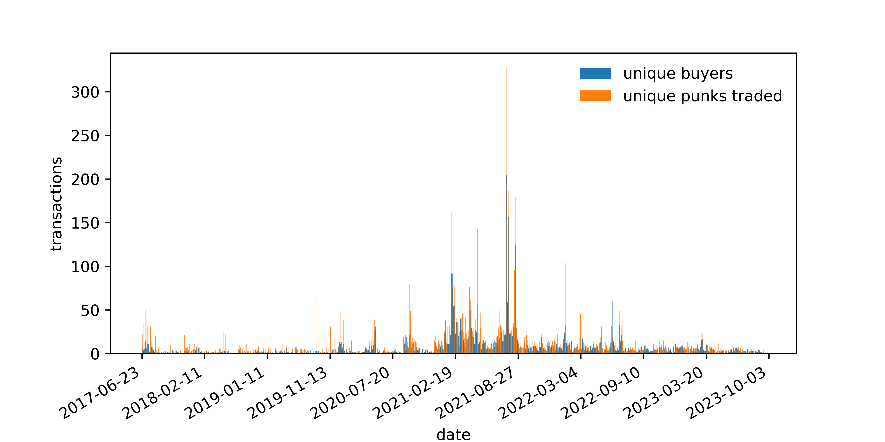

# CryptoPunk Analysis
## INTRODUCTION
Launched in June 2017 by product studio Larva Labs and acquired by Yuga Labs in 2022, CryptoPunks is one of the first 
NFT collections on the Ethereum blockchain. It consists of 10,000 unique 24×24 pixel art images depicting primarily 
humans (male and female). There are several other unique types that are considered more valuable due to their 
rarity. These include zombies (88), apes (24) and aliens (9).  
Each CryptoPunk can also exhibit a combination of 87 unique properties. These are called "features" and include hats, 
pipes, necklaces, earrings, eye patches, etc.  
The maximum number of features a single CryptoPunk can have is seven. However, only one CryptoPunk exists with seven 
features, #Punk 8348. It has cigarettes, earrings, moles, buck teeth, classic shades, top hats and a beard. CryptoPunks 
can also have zero features, but most tend to have two or three.  
The following describes the basic information about blockchain and Ethereum.  
Blockchain is best described as a public database that is updated and shared by many computers in a network.  
"Block" means that data and status are stored in sequential "chunks". If you send ETH to someone else, the 
transaction data needs to be added to a block for it to be successful.  
"Chain" refers to each block's cryptographic reference to its parent block. In other words, blocks are linked together. 
The data within the block cannot be changed without changing all subsequent blocks, but changing subsequent blocks 
requires the consensus of the entire network.  
Every computer in the network must agree on each new block and chain. These computers are called "nodes". Nodes ensure 
that everyone interacting with the blockchain has the same data. To complete this distributed protocol, the blockchain 
requires a consensus mechanism.  
Ethereum is a blockchain with computers embedded within it. It is the foundation for building applications and 
organizations in a decentralized, permissionless, censorship-resistant way.  
In the Ethereum universe, there is a canonical computer (called the Ethereum Virtual Machine, or EVM) whose state is 
unanimously agreed upon by everyone in the Ethereum network. Everyone participating in the Ethereum network 
(each Ethereum node) keeps a copy of the state of that computer. Additionally, any participant can broadcast requests 
to this computer to perform arbitrary computations. Whenever such a request is broadcast, other participants on the 
network inspect, verify, and perform ("perform") the computation. This execution causes a state change in the Ethereum 
Virtual Machine that is propagated throughout the network.    
This article aims to analyze the development history of CryptoPunks and give some insights.

## DATA EXTRACTION
There are three types of transactions in Ethereum:  
Regular Transaction: A transaction from one wallet to another.  
Contract deployment transaction: a transaction without a "to" address, the data field is used for the contract code.  
Execution Contract: A transaction that interacts with a deployed smart contract. In this case, the "to" address is the 
smart contract address  
Regular transactions refer to transfers that only involve Ether, the native token of Ethereum, and do not involve calls 
to contracts or transactions with other tokens in Ethereum. The data in regular transactions can be roughly divided into 
four blocks: transaction hash, time, etc. belong to the transaction index (index), which provides information to locate 
the transaction. The transaction amount specifically refers to the amount of Ether transferred. The sender and receiver 
of the transaction are each other's counterparties in this transaction. The consumption of gas fees is the transaction 
cost that the sender of this transaction needs to bear.   
In addition to the above data, transactions involving smart contracts will also have three additional pieces of content:  
(1) The internal process of Ethereum executing transactions (internal transactions);  
(2) The result of the token transfer (token transfer);  
(3) Input parameters (input data) for contract execution  
In a contract source code, not only the contract method (function) will be defined, but also the event and 
the submission event. The submission event will be recorded in the log, and finally the log will be recorded 
in the receipt function of a transaction that calls the contract.  
CryptoPunk belongs to the third type of transaction. Using DUNE can save the work of decoding part of the hash bytecode.  
Dune preprocesses blockchain data into relational database (PostgreSQL and DatabricksSQL) tables, allowing users to 
query blockchain data using SQL and build dashboards based on query results. The data on the chain is divided into 4 
original tables: blocks, transactions, (event) logs and (call) traces. Popular contracts and protocols have been 
decoded, each with its own set of events and call tables.

## DATA ANALYSIS
After saving the downloaded csv table, we can use python to read it for further visual analysis and the construction of 
artificial intelligence models.  
We first explore the trade trend over the years. 
<figure>
    
</figure>
We collected transaction data from the release of CryptoPunk to May 23, 2023. By analyzing the daily transaction volume
(in usd), we can see that until the beginning of 2021, the entire CryptoPunk transaction volume was relatively low.   
From the end of January 2021, the transaction volume began to grow, and reached its peak on February 12, 2022. 
CryptoPunk trading was active from November 30, 2020, to March 30, 2022.  
<figure>
    
</figure>
By observing the price chart and transaction number chart of eth, we can find that they have similar cyclicality. 
<figure>
    
</figure>
An analysis of the current CryptoPunk owner data found that a total of 2,926 accounts own CryptoPunk, 
with an average of 3.42 CryptoPunks per person, of which 11 accounts have more than 100 CryptoPunks, 
and 106 accounts have more than 10 CryptoPunks. 96% of people own less than 10 CryptoPunks. 
4% of people own more than 55% of CryptoPunks. 
Through investigation, it was found that on August 23, 2021, Visa, the credit card company, 
announced that it had purchased CryptoPunk No. 7610 at a price of 49.5 Ethereum (approximately US$150,000), 
just after Visa announced the purchase of this NFT. Within an hour, 90 CryptoPunks were traded, with the transaction 
volume on that day exceeding US$100 million. A total of 2,516 CryptoPunks were traded throughout August, 
with an average selling price of US$267,000. Trading volume peaked at $140 million on August 28.   
Yuga Labs acquired CryptoPunks in March 2022. Yuga Labs said that with the acquisition, they aimed to cultivate a 
"community of builders" to create derivative works around the two projects. To achieve this, Yuga Labs began 
transferring IP, commercial, and exclusive licensing rights to individual NFT holders, just as they did with their 
BAYC series. During the same period, the price of Ethereum entered a stage of steep decline.   
The output data counts the number of transactions between buyers and CryptoPunks as well as the higher transaction 
amounts. Interested readers can download the relevant data.

## CONCLUSION
CryptoPunks got off to a slow start. The series launched in June 2017. The developer keeps the first 1,000 and the 
remaining 9,000 are free. Because you need an Ethereum wallet to collect one, supply is limited to those already 
invested in the cryptocurrency.  
CryptoPunks did not create a high transaction volume at first. As the price of Ethereum increased and people paid 
attention to NFT, CryptoPunks also ushered in the peak of transaction volume.  
From an investment perspective, on July 6, 2017, Alien Punk #3100 sold for 8 ETH. That was about $2,000 at the time. 
Nearly four years later, in March 2021, the same punk sold for a staggering 4,200 ETH. This equates to $7.58 million. 
Some users have made considerable profits from it.  
Over time, CryptoPunks have come to be viewed as an investment and a status symbol. 
People in the NFT community tend to view the owners of CryptoPunks as builders and visionaries. Given their history, 
and the way they have grown and evolved from their early days alongside the Ethereum blockchain, some believe owning 
a punk is like betting on the importance of NFTs and the Ethereum blockchain.  
As the cryptocurrency markets such as Ethereum enter a stable period, the overall transaction volume of CryptoPunks 
also enters a stable period.

